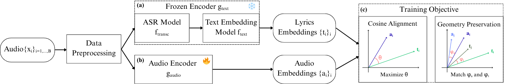

# Lyrics-Informed Version Identification (LIVI)

## Abstract

Music Cover Retrieval, also known as Version Identification, aims to recognize distinct renditions of the same underlying musical work, a task central to catalog management, copyright enforcement, and music retrieval.
State-of-the-art approaches have largely focused on harmonic and melodic features, employing increasingly complex audio pipelines designed to be invariant to musical attributes that often vary widely across covers. While effective, these methods demand substantial training time and computational resources.
By contrast, lyrics constitute a strong invariant across covers, though their use has been limited by the difficulty of extracting them accurately and efficiently from polyphonic audio.
Early methods relied on simple frameworks that limited downstream performance, while more recent systems deliver stronger results but require large models integrated within complex multimodal architectures.
We introduce LIVI, a Lyrics-Informed Version Identification framework that seeks to balance retrieval accuracy with computational efficiency. Leveraging supervision from state-of-the-art transcription and text embedding models, LIVI achieves retrieval accuracy on par with—or superior to—audio-based systems, while remaining lightweight and efficient by eliminating the transcription step, challenging the dominance of complexity-heavy multimodal pipelines.

---

## Pipeline Overview

The LIVI pipeline consists of three stages (Fig. 1):

1. **Lyrics-Informed Target Space**
   - Vocal segment detection (vocal detector).
   - Whisper-based transcription of detected segments.
   - Pre-trained multilingual embedding models to create chunk-level lyrics embeddings.

2. **Audio Encoder Training**
   - Whisper encoder (frozen) processes audio spectrograms.
   - Lightweight projection head maps Whisper states into the lyrics embedding space.
   - Training objective combines MSE alignment for geometry preservation, and cosine similarity for audio-lyrics pairwise alignment.

3. **Inference & Retrieval**
   - At inference, only the audio encoder is required (no ASR).
   - Audio is mapped into the lyrics-informed space.
   - Retrieval is performed via cosine similarity.

<p align="center">
  
</p>

---

## Repository Structure

```
src/livi/
  apps/
    frozen_encoder/     # ASR + text embeddings (CLI: livi-frozen-encoder)
    audio_encoder/      # Training + inference (CLI: livi-audio-encoder)
    retrieval_eval/     # Retrieval metrics & ranking (CLI: livi-retrieval-eval)
  core/                 # I/O helpers & utilities, 30s audio chunks extraction
data/                   # User-provided datasets
results/                # Metrics, figures
```

---

## Installation

### Poetry

```bash
poetry install
poetry shell
```

### Docker (recommended)

```bash
make build
make run-bash  # Open container shell
```

Requirements:

- Python >= 3.11
- CUDA-enabled GPU for training/inference
- ffmpeg

---

## Model checkpoints/config (LIVI Audio Encoder)

**Checkpoints**: download the checkpoint following this [url](https://drive.google.com/drive/folders/1hqkj7E1L2Tj-DwIbGXyRDcSGI_REq5Kf?usp=sharing) and place the `.pth` under:
  `
src/livi/apps/audio_encoder/checkpoints/livi.pth
  `

**Config**:Default configuration files are provided:

- *Training:* [`src/livi/apps/audio_encoder/config/livi.yaml`](src/livi/apps/audio_encoder/config/livi.yaml)  
- *Inference:* [`src/livi/apps/audio_encoder/config/infer.yaml`](src/livi/apps/audio_encoder/config/infer.yaml)  

These YAMLs include the exact hyperparameters and settings reported in the paper.  

---

## Data Organization

Expected layout:

```
data/
  raw/
    audio/                # .mp3
    metadata/             # CSV with version_id, md5_encoded
  processed/
    text_embeddings/      # .npz id → vector or list[vectors]
    audio_embeddings/     # .npz id → vector or list[vectors]
results/
  metrics/
  figures/
```

---

## CLI Applications & Usage

All apps use [Typer](https://typer.tiangolo.com/). Use `--help` on any command to see options.

### 1. Frozen Encoder (Lyrics Pipeline - Figure 1.a)

Detect vocals → transcribe → embed lyrics.

```bash
poetry run livi-frozen-encoder inference \
  --audio-dir data/raw/audio \
  --out-path data/processed/text_embeddings/text.npz  

```

### 2. Audio Encoder (Training & Inference)

```bash
poetry run livi-audio-encoder inference \
  --audio-dir data/raw/audio \
  --out-path data/processed/text_embeddings/audio.npz  
```

**Training:**

```bash
poetry run livi-audio-encoder launch-training
```

### 3. Retrieval Evaluation

Compute retrieval metrics.

```bash
poetry run livi-retrieval-eval evaluate   
  --path-metadata   data/raw/metadata/benchmark.csv   
  --path-embeddings data/processed/text_embeddings/teaudioxt.npz   
  --col-id version_id   
  --text-id lyrics   
  --k 100   
  --path-metrics results/metrics/metrics.csv
```

Other commands are also available. See the `cli.py` files for more details.
